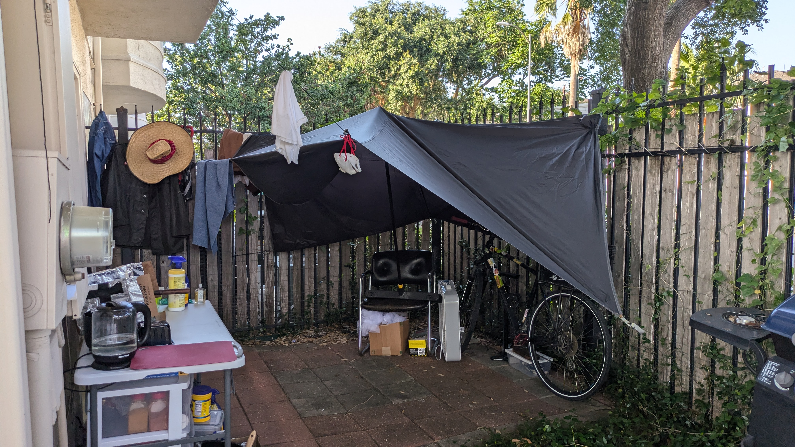
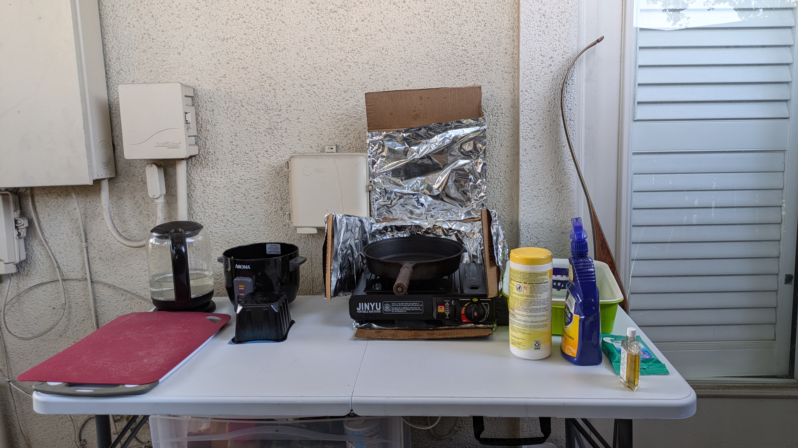
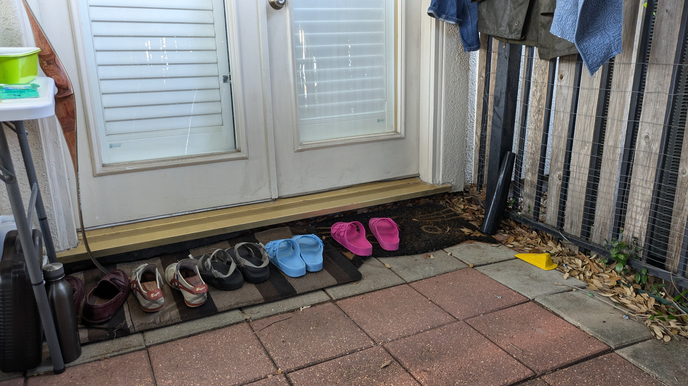

+++
title =  "Make an Outdoor Living Room"
date = "2024-06-13"
description = "Making an outdoor space to kick it"
author = "Justin Napolitano"
tags = ['diy','lifestyle']
+++

<!-- # JB Welding a front bumper  -->

Even in the heat a nice outdoor space can be a reprieve from every day life.  

## Why

It is hot out. It is sunny. My bike doesn't like the uv. I don't like the uv. I also make stinky food. So I need a tarp protect myself from the heat and a stove to cook.  

## Tools and Materials

* A solid little knife.
* Some bank line.
* Any old tarp.
* A stove.
* A chair you've picked up off the side of the road.
* A table.
* A random bow 
* Rice cooker.
* A water boiler

## Skills

Know how to tie
* Half hitches.
* Trucker hitches.
* Alpine butterflies.
* Clove hitches.

## Hang your tarp

### Affix a ridge line

Place a ridge line across two points. Make it high and tight. 

I tie off the anchor side side with a clove hitch and some half hitches to keep the thing from coming apart. 

The other side I tie off with a constrictor and a truckers hitch. I'll detail that in another post that'll be linked here. 

### Pull the tarp over the ridge line

Pull your tarp over the ridge line. There are a ton of variations, but I chose an oblong diamond shaped pattern to better fit my location.

### Anchor the tarp to the ground

In my case I tied the bottom grommets to the fence posts, a grill, and a water storm drain. These worked for me and did not require any stakes or rocks.

### Tie out the midpoints

My tarp has a few point that I can use to pull middle of the tarp out to extend coverage. Once side broke during a previous storm, so I just put a ball of some fabric in the tarp and tied that off instead. 

## Create your kitchen

### Put up your table

You don't really need a table. Before I bought one, I just squated on the ground. It wasn't very comfortable, but it was a great workout.  Anyways, you should get a table if you can afford one. 

### Put up your stove

I just have a little jinyu portable stove that I bought years ago for hot pot.  Now I use it as my primary to avoid stinking up my house with curry and five spice powder. 

#### Make a heat shield

I created a little heat shield for the stove by cutting a cardboard box. I then wrapped it in aluminum foil. I taped the edges to create little hinges to close it up when not cooking. This is important because it protects the table, the walls, and the rice cooker.  

### Set up the Rice Cooker

It is absolutely necessary

### Set up the boiler

A water boiler is used to make sure all of the water (especially the tap water) is clean before drinking or cooking. A few liters a day will be good for you.  

### Organize your things

Just organize all of your things.  Do not leave this place messy. That would be gross. 

## Set up your entrance

### Clothing space

I do not like wearing my dirty chore clothing inside my home. I change right there in my private space into my underwear and hang the dirty clothes up on the fence to air out.  My sun shirts and base layers come in after a few hours. The work jeans and the overalls mostly stay out there until I wash them.

### Shoe space

I take my shoes off when I enter my home.  Its the right way to do it. So keep some sandals for indoors and outdoors ready. Also make sure this space is tidy.

#### That tidy shoe line

## Enjoy

So this space is now protected from the sun. It is organized. And it is tidy. It is a good spot to store your bike. It is a good spot to cook. It is a good spot to sit. It is good. 